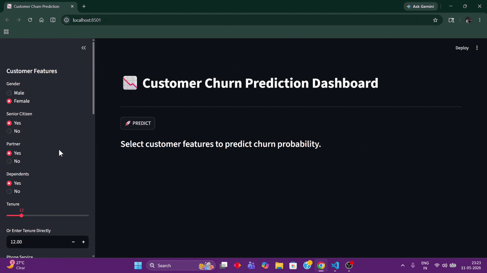
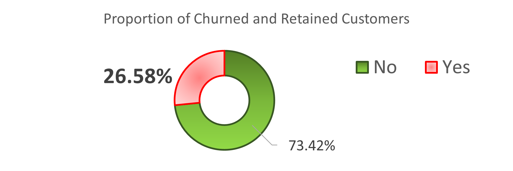
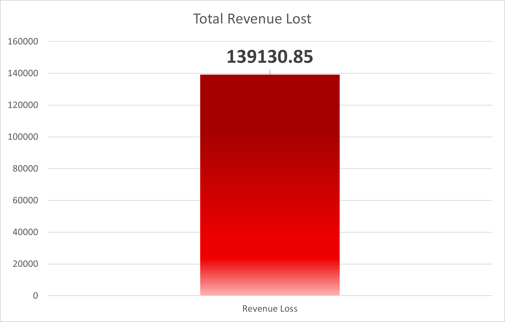
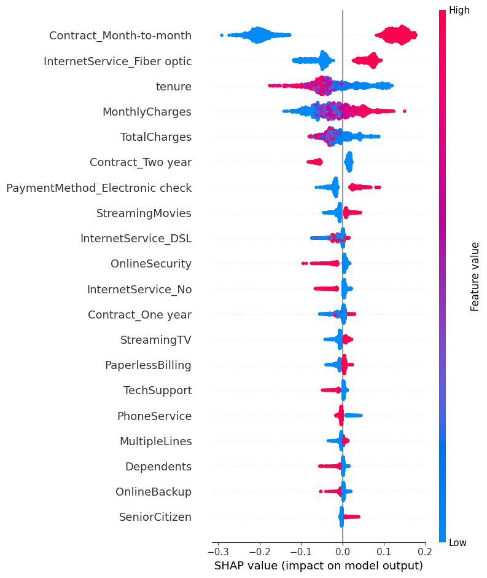
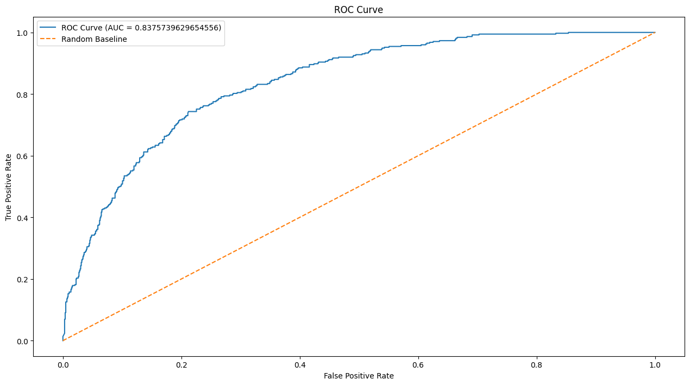

# 📈 AI-Driven Customer Retention System

A **business-focused analytics platform** for a **telecom company** that:
- Projected a churn reduction by **6.62** percentage points, from **26.58%** to **19.96%**.
- Projected monthly revenue savings of **$37,000+** per month.
- Successfully identified approximately **83%** of all churners.
- Identified the **top 6** key drivers of churn.
- Delivered **top 7** data-backed insights and retention recommendations.
- Built an interactive system for evaluating churn risk based on customer attributes.


---

## [CLICK HERE FOR LIVE DEMO](https://ai-driven-customer-retention-system.streamlit.app/)

---

## Table of Contents

1. [Business Problem](#business-problem)
2. [Objective](#objective)
3. [Business Insights](#business-insights)
4. [Immediate Recommendations](#immediate-recommendations)
5. [Key Results](#key-results)
6. [Project Documentation](#project-documentation)
7. [Project Features](#project-features)
8. [App Features](#app-features)
9. [Stakeholders' Benefits](#stakeholders-benefits)
10. [Tech Stack](#tech-stack)
11. [Project Structure](#project-structure)
12. [Project Methodology](#project-methodology)
13. [How To Install and Run](#how-to-install-and-run)

---

## Business Problem 

*Customer churn* in **subscription-based industries**, like this telecom company, directly affects
revenue by halting a **customer's lifetime value (CLTV)** and increasing the
**costs required for customer acquisition (CAC)**, that eventually affects the overall
business growth.

The data provided by the company revealed a churn rate of **26.58%**. Analysis of the typical churn profile showed that the average monthly charge of customers who churned was approximately **$82**. The total revenue lost due to churn was totalled to be **~139,130**.



Not just revenue loss, but high **churn** also shows **declining customer loyalty**, **degrading customer experience**, and indirectly boosts **competitor growth**.



---

## Objective
This project was developed to help the business:
- Identify customers at risk of churning.
- Understand the underlying drivers behind churn.
- Support proactive retention strategies.
- Improve decision-making through analytics and AI-assisted insights.
---

## Business Insights

The company had an initial churn rate of **~26.58%**.

Analysis revealed that churn was strongly associated with:
- **Monthly subscriptions**, with longer duration subscriptions having a lesser rate of churn.
- **Higher monthly charges**, suggesting a mismatch in **customer expectation**, **value perceived**, and **customer needs**.
- **Tenure**, with lower tenured customers being more likely to churn.
- **Fiber optic internet** connection, pointing to possible **connectivity issues** and/or **high cost compared to value**.
- Not having associated **value added services** such as **Online Security** or **Tech Support**.
- **Electronic check** payments, possibly due to a problem with the payment gateway.

The system will enable the business to proactively identify high-risk customers and apply targeted retention strategies before customer loss occurs.



---

## Immediate Recommendations

- Send a **feedback form** initially via mail to **all present customers** asking on a **scale of 1 to 5** how 
they would rate their experience or satisfaction regarding different services availed by them, 
followed by Whatsapp (if registered) or calls till we get the highest amount of response 
possible.
- A **separate feedback call** to be made to **churned customers** to identify key areas 
where they faced problems that ultimately made them churn.
- **Employees that onboard customers** should be given **training** in batches to make sure that 
their **understanding** about the products and services are adequate and up to date so that they 
will be **better able to assist customers**.
- A **specialized triage team** should be assembled, comprised of **employees with deep 
understanding** about the products and services, so that they might be able to **analyse the 
feedback responses**.
- A **special discount** can be given to customers opting for **fiber optic** connections along with 
**add-ons** in the **one-** and **two-year contract** types.
- The **billing team** must **assess** the **payment gateway** to **identify** any **problems** customers 
are facing in **electronic check payments** and those receiving **paperless billing**.
- A **feedback section** must appear **after payment** that lets the **customer rate** how **easy** it was to **make the 
payment**, and if any problems were faced. 

---

## Key Results

| KPI | Result |
|------|--------|
| Initial Churn Rate | 26.58% |
| Projected Churn Rate | 19.96% |
| Recall | 0.83 |
| Precision | 0.47 |
| ROC-AUC | 0.84 |
| Estimated Monthly Savings | $37,000+ |

---

## Project Documentation

The entire project documentation is available [here](Customer_Retention_System.pdf).

And the Excel file with formatted tables, charts, EDA and hypothesis testing is available [here](excel/telco_customer_churn.xlsx).

---

## Project Features

- Analysis and identification of the key drivers of churn
- Class-imbalance identification and handling
- Hypothesis testing to find association and assess it's strength
- Multicollinearity identification via VIF aiding feature selection
- Finding the profile of an average churner based on analysis
- Data-backed insights and suggestions to combat churn
- Selection of predictive analytics model based on the business case
- Feature validation and selection, along with data encoding
- Training and validation of multiple models based on desired metric
- Selection of the best performing model as the final model
- Testing and evaluation of the final model
- Deployment of a dynamic platform that allows churn risk analysis of a customer
- Data backed AI insights with SHAP value explanations

---

## App Features

- Interactive and dynamic churn risk analysis
- Business-oriented KPI monitoring
- Risk-based customer segmentation
- Churn prediction via Machine Learning application
- AI-generated and data-backed retention recommendations
- SHAP-powered model explainability

---

## Stakeholders' Benefits

This project will provide actionable insights to:
- **Product managers**, as they will be able to identify product-related issues that contribute to customer churn, paving a way for data-driven improvements.
- **Marketing teams** will be able to target high-churn-risk customers with personalized retention strategies, reducing the reliance on expensive blanket campaigns.
- **Customer success teams** will be able to understand key drivers of dissatisfaction, enabling better outreach and improvement in customer satisfaction.
- **Leadership** will be able to gain a high-level view of behavioural trends and churn, enabling data-backed decision making.
- **Business analysts**, as they will be able to further analyze churn patterns, to support ongoing monitoring and reporting.

---

## Tech Stack

1. **Microsoft Excel**
    - **PowerQuery** - For initial data preparation, cleaning and feature engineering.
    - **Pivot Tables** - For initial look into the data and identifying high-level trends.
    - **Pivot Charts** - Business-friendly visualizations for quick trend analysis and reporting.
    - **SUMIFS, COUNTIFS, and Lookup Functions** - To perform quick aggregations and look up desired values.
2. **Python**
    - **Pandas** - For data cleaning, manipulation, summarization, EDA and preprocessing
    - **NumPy** - For numerical operations and feature handling
    - **Matplotlib / Seaborn** - For visualization and deeper EDA
    - **Scikit-learn** - For data preprocessing, model building, and evaluation
    - **Imblearn** - for SMOTE techniques used and building pipelines
    - **Xgboost** - For implementation of XGBClassifier algorithm
    - **LightGBM** - For implementation of LGBMClassifier algorithm
    - **Catboost** - For implementation of CatBoostClassifier algorithm
    - **Pathlib and Sys** - For directory related tasks
    - **Joblib** - For saving and loading trained models
    - **Streamlit** - For deploying the AI Driven Customer Retention System
    - **Groq** - For the LLM layer using the **llama-3.3-70b-versatile** model
3. **Git and GitHub** - For version control.

---

## Project Structure

```
AI_Driven_Customer_Retention_System
│
├── data/
│   ├── CB_DiffParams.csv
│   ├── coeff_after_one_drop.csv
│   ├── coeff_before_drop.csv
│   ├── DT_Baseline_DiffParams.csv
│   ├── DT_Baseline_DiffParams_balanced.csv
│   ├── DT_SMOTENC_DiffParams_balanced.csv
│   ├── DT_SMOTETomek_DiffParams_balanced.csv
│   ├── LGBM_DiffParams
│   ├── log_reg_l2_regu_diff_c.csv
│   ├── log_reg_no_regu.csv
│   ├── RFC_DiffParams
│   ├── smoteenn_log_reg_l2_regu_DiffC.csv
│   ├── smoteenn_log_reg_NoRegu.csv
│   ├── smotenc_log_reg_l2_regu_DiffC.csv
│   ├── smotenc_log_reg_NoRegu.csv
│   ├── smotetomek_log_reg_l2_regu_DiffC.csv
│   ├── smotetomek_log_reg_NoRegu.csv
│   ├── telco_customer_churn_clean.csv
│   ├── vif_init_sol.csv
│   └── XGBC_DiffParams.csv
│
│
├── excel/
│   └── telco_customer_churn.xlsx
│
│
├── assets/
│   ├── class_imbalance.png
│   ├── ROC_Curve.png
│   ├── avg_churner_charge.png
│   ├── churn_rate.png
│   ├── demo.gif
│   ├── revenue_loss.png
│   └── SHAP.png
│
│
├── model/
│   └── xgb_churn_model.pkl
│
│
├── notebooks/
│   ├── BaselineModels.ipynb
│   ├── DataPreparation.ipynb
│   ├── FinalModelTrainPredict.ipynb
│   ├── HypothesisTesting_&_VIF.ipynb
│   ├── LinearModels.ipynb
│   ├── RoughWork.ipynb
│   └── TreeModels.ipynb
│
│
├──src/
│   ├── ai_gen/
│   │   ├── __init__.py
│   │   ├── ai_gen.py
│   │   └── prompt.txt
│   │
│   ├── helpers/
│   │   ├── __init__.py
│   │   ├── cat_boost_data.py
│   │   ├── load_data.py
│   │   └── tree_data.py
│   │
│   │
│   └── shap_gen/
│       ├── __init__.py
│       └── shap_gen.py
│
├── LICENSE
│
│
├── app.py
│
│
├── Customer_Retention_System.pdf
│
│
└── README.md

```

---

## Project Methodology

### Data Cleaning, Analysis and Recommendation

The **data** was first **collected** and cleaned in **Microsoft Excel** using **Power Query**, and then initial data **observations** were made. Univariate, bivariate and multivariate analysis was then done on the cleaned and transformed data using **Pivot Tables**, **Pivot Charts**, and functions like **SUMIFS**, **COUNTIFS**, and **Lookup Functions**. Insights were then found regarding the actual **data distribution**, and the **key contributors** to **churn** were then found using statistical analysis tests, such as **Chi-Square - Cramer's V** and **Mann-Whitney-U - Eta**. The **underlying trends and patterns** behind customers who churned were also discovered, and the typical profile of a churner was identified. Using all the aforementioned data, the total **revenue loss** from churn was reported and then **impact** was discussed. Several **recommendations** were provided as at this point and immediate implementation was suggested as a first-line-defence measure. The need for a **customer retention system** was emphasized at this point, after which the **modelling** began for the predictive analysis.

### Feature Validation and Evaluation

Using **Variation Inflation Factor (VIF)**, **multicollinearity** was identified, and a stable state was found after **dropping** a couple of features. But given that one of these **features** had immense **business relevance**, an **L1 Regularized Logistic Regression** model was run to **observe** how the **coefficients** behaved in the presence of all features. After the **multicollinearity** was **revalidated** through the **unstable coefficients** across **different regularization strengths**, one single derived column was dropped which **stabilized the coefficients**, while keeping the **business relevant** features **intact**.

### Models Under Consideration

With the features finalized, appropriate **predictive models** were discussed and the following were finalized:

- **Linear Models**
    - **Logistic Regression without any regularization** to get a baseline level of performance.
    - **L2 Regularized Logistic Regression** to find possible benefits from regularization.
    - **Non-regularized and L2 regularized Logistic Regression with SMOTENC** oversampling technique, as **SMOTENC** preserves the categorical relationships.
    - **Non-regularized and L2 regularized Logistic Regression with SMOTEENN** mixed-sampling technique, as **SMOTEENN** undersamples the majority class and oversamples the minority class.
    - **Non-regularized and L2 regularized Logistic Regression with SMOTETomek** mixed-sampling technique. It is similar to **SMOTEENN** as it undersamples the majority class and undersamples the minority class, but it is not as aggressive as **SMOTEENN**, which aggressively removes huge chunk of the majority class at the borderline. **SMOTETomek** preserves a lot of the underlying information, also around the borderline, as it is less aggressive, preserving a lot more real data for the models to train on.

- **Tree Based Models**
    - **Decision Tree** to see how a basic tree model performs on the data.
    - **Random Forest** to observe the performance of an ensemble tree method on the data.
    - **XGBoost** to observe the performance of boosting tree algorithms on the data.
    - **LightGBM** to observe if the model can give similar results to **XGBoost** while cutting down on training time, if relevant.
    - **CatBoost** to observe if a newer architecture tree can provide better results as it requires the least amount of data encoding.

### Data Encoding and Transformation

With the **predictive models** finalized, the **data encoding** required was clear.

- The **linear models** required **one hot encoding** for **nominal features** with multiple classes, with one of the class columns dropped because of the property of linearity, **ordinal encoding** for the **ordinal features**, and also for the **nominal binary features**, and **label encoding** for the **target variable**.

- **Tree based models** apart from **CatBoost** required the same encoding as the **linear models** with one difference, that none of the **one hot encoded** class columns should be dropped as tree based models are different from **linear models**

- **CatBoost** required the least amount of encoding, and just the cleaned and adjusted data was enough.

Keeping in mind **reproducibility** and **modularity**, and in an effort to minimize **repeated code**, **helper functions** were written, which **encoded** the data as per the **model requirement**.

### Model Training and Cross-Validation

All the **models** were then trained on the **class-balanced** data, using 5 fold **cross-validation**, and each model's performance was measured on the basis on **recall**, **precision** and **F1 score**. This is because in the current **business scenario**, misidentifying a churner **(false-negative)** is much **more expensive** than extending retention efforts towards loyal customers misidentified as churners **(false-positives)**.

### Model Selection

**XGBoost** was found to have the best **recall** at **~0.85** with a respectable **precision** of **~0.50**, and when evaluated on unseen test data, it achieved a **recall** of **~0.83** and a **precision** of **~0.47**. This model was finalized. The **ROC-AUC score** was found to be **~0.84**.

|Metric|Cross-validation score|Test score|
|------|----------------------|----------|
|Recall|0.85|0.83|
|Precision| 0.50|0.47|
|F1-score|0.63|0.60|

The **ROC-curve is shown below**.



### App Building and LLM Layer

With the **model** finalized, it was saved as a **.pkl** file using **joblib**, and a **streamlit app** was designed, **based on the customer features**, which accepts the **customer attributes** as inputs, and provides a **prediction** on the **churn risk**, with a **probability** quantifying that risk. **Risk Segmentation** was done here. As the **model was trained with respect to recall**, anybody with a **churn probability** of **< 41%** is considered safe. Anybody with a **churn probability** of **> 41%** but **< 50%** is considered safe, but **caution is advised**. And, customers with a **churn probability** of **> 50%** is considered an **at-risk** customer, and for these customers, the **LLM model** kicks in to provide **AI assisted insights**, backed by SHAP on **retention strategies**.

The aforementioned **LLM** is **prompted** with the **available data**, **information** and **insights** and it provides **retention strategy recommendations** accordingly.

### Business Impact

Using the above **system**, considering a conservative **retention effort turnaround** of **~30%** and with the **average monthly-charge** of a **churner**, derived from **analysis-backed profiling**, being **~$80**, the churn rate was projected to come down to **~19.96%**, which is a **6.62** percentage point reduction from the original rate, giving the company revenue savings of **~$37,000 +** monthly.

---

## How to Install and Run

1. clone the repository
```bash
git clone https://github.com/trucoshan/AI_Driven_Customer_Retention_System.git
```

2. Navigate to the project directory:
```bash
cd AI_Driven_Customer_Retention_System
```

3. Install all required dependencies:
```bash
pip install -r requirements.txt
```

4. Make a directory named ".streamlit/" and then navigate into it
```bash
mkdir .streamlit && cd .streamlit
```

5. Make a file here called "secrets.toml"
```bash
touch secrets.toml
```

6. Visit [Groq](https://groq.com/) and click on **Start Building**

7. Sign up and then on the **main page** click on **Create API Key**

8. Copy the API Key and keep it in a safe place.❗**Do not share it or reveal it publicly**

9. Navigate to the .streamlit/secrets.toml file and assign the API key
```bash
cd [Your Directory]/AI_Driven_Customer_Retention_System/.streamlit
```
then
```bash
echo '"GROQ_API_KEY" = "your_groq_api_key"' > secrets.toml
```
10. Once setup is complete, navigate to the project root
```bash
cd ..
```
11. Now you can run the app.
```bash
streamlit run app.py
```

---

